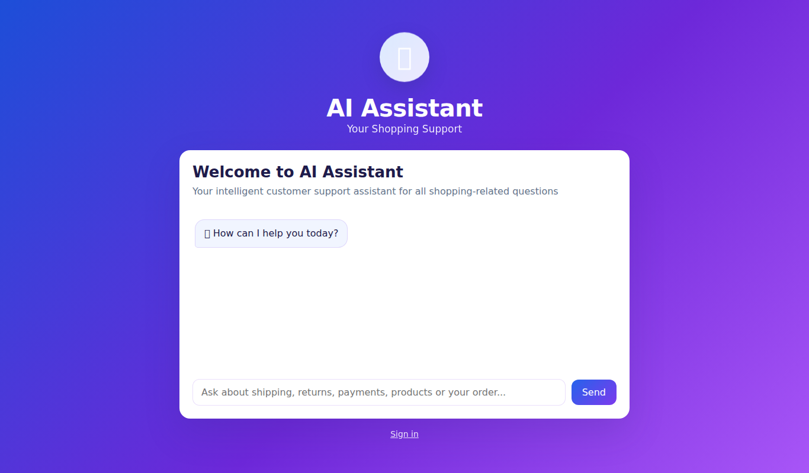
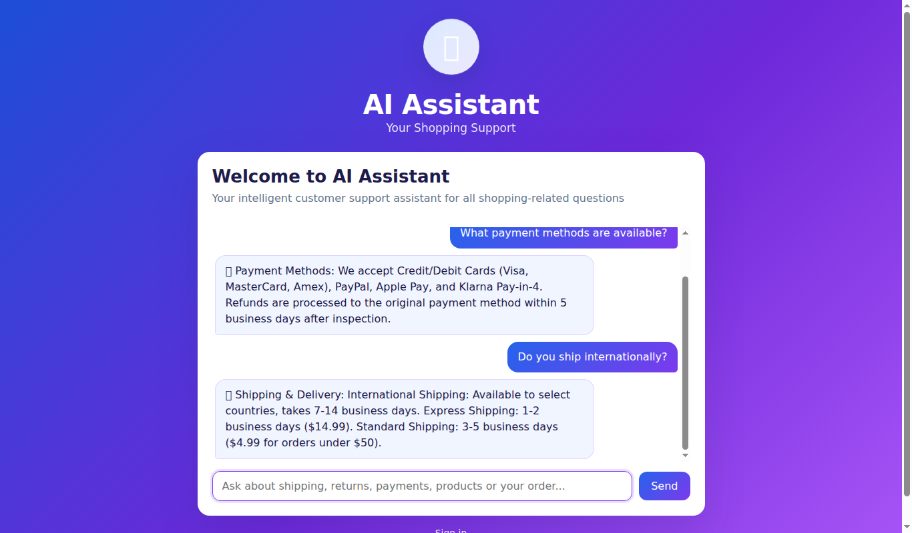
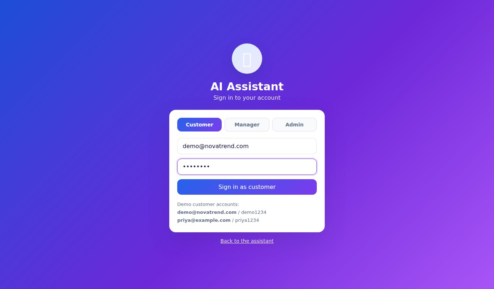
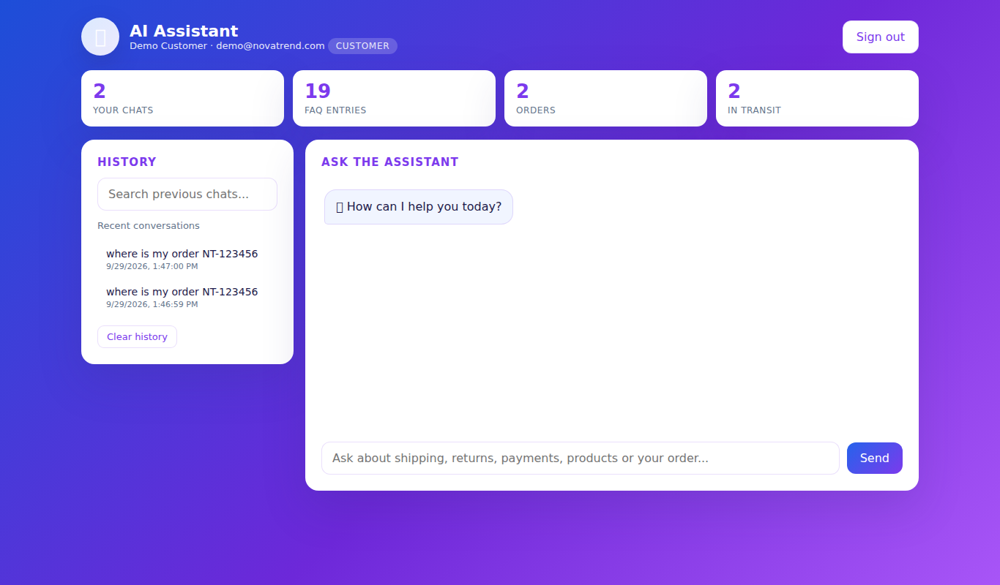
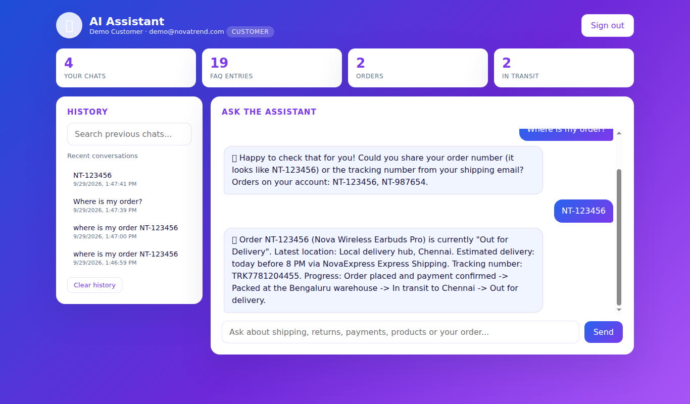
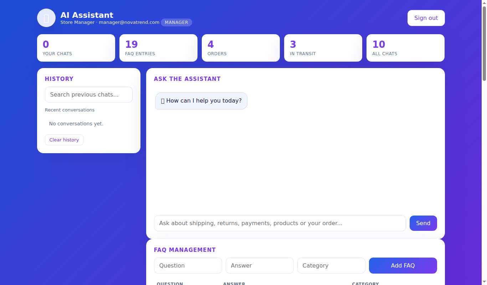
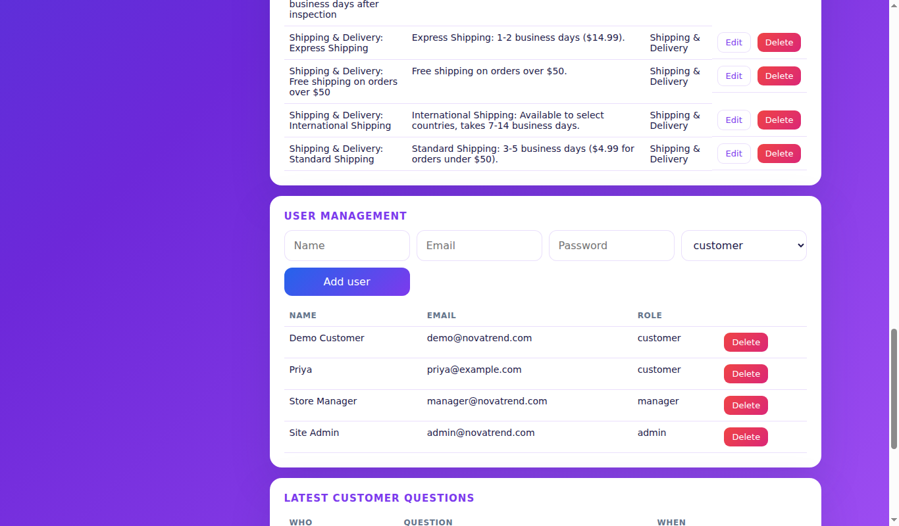

# Phase 8 – Project Demonstration

## Demo script (about 5 minutes)

1. **Start the app** – `npm start`, open `http://localhost:3000`
2. **Guest chat** – ask *"What payment methods are available?"* and *"Do you ship internationally?"*
3. **Guest order tracking** – ask *"Where is my order?"* → assistant asks you to sign in
4. **Customer login** – `demo@novatrend.com` / `demo1234` on the Customer tab
5. **Customer dashboard** – point out the chats, FAQ entries, orders and in-transit cards
6. **Order tracking** – ask *"Where is my order?"*, then type `NT-123456`
7. **Manager** – log in as `manager@novatrend.com` / `manager1234`, add an FAQ, ask the bot about it
8. **Admin** – log in as `admin@novatrend.com` / `admin1234`, show user management
9. **API** – run `npm run test:api` to show all 41 checks passing

## Output screenshots

### Output 1 – AI Assistant home page

### Output 2 – FAQ answers (guest)

### Output 3 – Login page (Customer / Manager / Admin)

### Output 4 – Customer dashboard

### Output 5 – Order query: "Where is my order?"

### Output 6 – Manager dashboard with FAQ management

### Output 7 – Admin dashboard with user management

## Demo video
Add the recorded demo video link here: `<link>`
